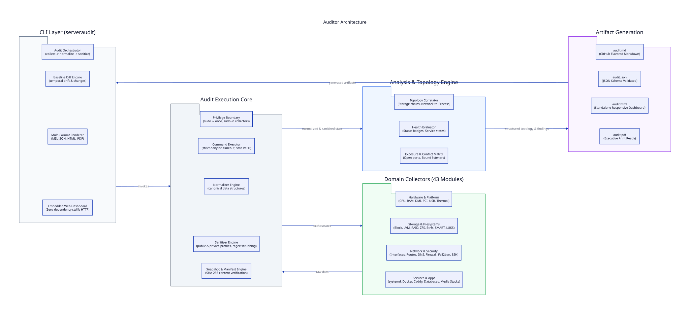
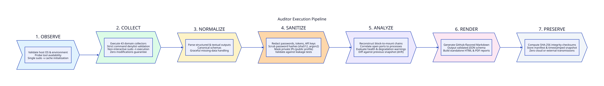

# Auditor (Linux Server Audit)

[](https://opensource.org/licenses/MIT)
[](https://www.python.org/downloads/)
[](https://github.com/MohnishShende/auditor/actions/workflows/ci.yml)
[]()
[]()
[]()
[]()

> **Comprehensive, open-source Linux server auditing, inventory, documentation, health inspection, topology mapping, and historical baselining system.**

---

## ⚡ Quick Start (Target Experience)

Clone the repository and run the automated installer:

```bash
git clone https://github.com/MohnishShende/auditor.git
cd auditor
./install.sh
```

### Run Your First Audit

Authenticate with `sudo` once when prompted:

```bash
serveraudit audit
```

*(Alternatively, run `./audit.sh` directly).*

The audit completes in seconds and outputs a structured Markdown report, canonical JSON, and interactive HTML dashboard into `audits/<hostname>-<timestamp>/`.

---

## 🏗️ Architecture & Pipeline

Auditor follows a strict observational lifecycle across seven dedicated phases:



### Execution Pipeline



---

## 🌟 Key Guarantees & Features

- **One Command & Single Sudo Validation**: Authenticate once via `sudo -v` at launch; privileged collectors execute with least privilege without repetitive password prompts.
- **Strict Observational Safety**: Guaranteed zero intentional system-configuration modification. No services restarted, no packages installed, no files changed.
- **Offline & Private**: Zero cloud dependencies, zero telemetry, zero analytics, zero AI requirements.
- **Hardware-to-Application Topology**: Reconstructs complete storage chains (`Disk → Partition → LUKS → LVM → Filesystem → Mount → Docker Bind → Container → Application → Caddy → Hostname`) and network-to-process bindings.
- **Secret-Aware Sanitization**: Built-in `private` and `public` (shareable) profiles. Automatically redacts passwords, tokens, private keys, database credentials, API keys, password hashes (`$6$`, argon2), and environment variables.
- **Historical Baselining & Configuration Drift**: Compare any two structured snapshots using `serveraudit diff <snapshot-a> <snapshot-b>` to detect exact changes across kernel, packages, SSH, Docker, and storage.
- **Canonical Structured Format**: JSON is the source of truth; produces clean, human-readable Markdown product output, interactive HTML, and optional PDF.
- **Self-Hosted Web Interface**: Optional zero-dependency stdlib HTTP dashboard to monitor server identity, trigger audits, view reports, compare baselines, and download audit bundles.

---

## 📊 Sample Reports & Outputs

Check out the full synthetic example reports generated by Auditor:
- [📄 Sample Markdown Report (audit.md)](examples/audit.md)
- [📦 Sample Structured JSON (audit.json)](examples/audit.json)

---

## 📋 Comprehensive Audit Surface (43 Modules)

| Category | Inspected Subsystems |
|---|---|
| **System & OS** | Distribution, kernel, uptime, virtualization, machine identity, boot mode (BIOS/UEFI), Secure Boot, OS lifecycle |
| **Platform & Hardware** | Motherboard, DMI/SMBIOS, platform chassis, firmware, TPM version/state, ACPI, microcode |
| **CPU & Memory** | Processor model, cores, thread/NUMA topology, governor, frequencies, cache, CPU mitigations, RAM slots/DIMMs, ECC, swap, HugePages, PSI |
| **PCI & USB** | GPUs, NICs, SATA/NVMe controllers, USB topology, connected devices, kernel drivers, IOMMU groups |
| **Storage & SMART** | Block devices, NVMe/SATA health, temperatures, endurance, reallocated sectors, power-on hours, error logs |
| **Storage Subsystems** | Partitions, LVM (PV/VG/LV), Software RAID (mdstat), ZFS pools/datasets, Btrfs filesystems/subvolumes, LUKS encryption |
| **Filesystems & Mounts** | Types, UUIDs, mount options, disk utilization, inode usage, `/etc/fstab` consistency, NFS/CIFS network mounts |
| **Networking & DNS** | Physical/virtual interfaces, MACs, link speeds, IPv4/IPv6 addresses, routes, default gateway, DNS resolvers, systemd-resolved, hosts |
| **Ports & Firewall** | TCP/UDP listening ports, bound addresses, owning processes, UFW, nftables, iptables rules, NAT, forwarding |
| **Security & SSH** | OpenSSH client/server versions, effective `sshd -T` configuration, host key fingerprints, auth methods, AppArmor, SELinux, Seccomp, Kernel Lockdown, ASLR, sudoers |
| **Users & Groups** | Local accounts, UID 0 verification, locked accounts, password status without hashes, sudo permissions |
| **systemd & Processes** | Active/failed/masked units, timers, sockets, boot performance, process tree, top resource consumers |
| **Packages & Updates** | Installed packages (dpkg/apt), manual vs automatic, pending updates, pending security updates, Snap, Flatpak |
| **Docker & Containers** | Docker engine, containers, images, volumes, networks, Docker Compose projects, security posture (privileged, socket mounts, capabilities) |
| **Caddy & TLS/PKI** | Caddyfile sites, reverse proxy upstreams, TLS certificates, certificate validity, expiration warnings, local CA |
| **Applications** | Application-aware discovery (Jellyfin, Paperless, Pi-hole, qBittorrent, Sonarr, Radarr, Prowlarr, Bazarr, Kavita, SearXNG, databases) |
| **Scheduled & Backups** | Cron jobs, systemd timers, backup software detection (Restic, Borg, Duplicati, Rclone) |
| **System Health & Logs** | Journal errors, dmesg warnings, OOM events, thermal sensors, fan speeds, power/UPS state |
| **Permissions** | Targeted security checks on sensitive files (`/etc/shadow`, `/etc/sudoers`, SSH keys, Docker socket) |

---

## 🚀 CLI Commands & Usage

```bash
# 1. Run standard private audit (saved to audits/<hostname>-<timestamp>/)
serveraudit audit

# 2. Run public / shareable audit with aggressive redaction (for forums/GitHub issues)
serveraudit audit --profile public

# 3. List all past audits
serveraudit list

# 4. Compare two historical snapshots and detect configuration drift
serveraudit diff audits/nodezero-2026-09-20T100000 audits/nodezero-2026-09-24T100000

# 5. Re-render an existing audit snapshot to HTML or Markdown
serveraudit render audits/nodezero-2026-09-24T100000/audit.json --format html

# 6. Verify SHA256 integrity checksums of an audit bundle
serveraudit verify audits/nodezero-2026-09-24T100000

# 7. Start self-hosted web interface (optional)
serveraudit web --host 127.0.0.1 --port 8080
```

---

## 🔒 Security & Privacy Model

Auditor is engineered with safety as the primary invariant:
1. **Zero State Changes**: Commands executed by collectors are purely observational.
2. **Never Collects**: Passwords, password hashes, encryption passphrases, SSH private keys, TLS private keys, `.env` file credentials.
3. **Redaction Engine**: The built-in typed sanitizer scrubs tokens, API keys, database URLs, and environment variable secrets.
4. **Public Profile**: In `public` mode, internal IP addresses, MAC addresses, hardware serial numbers, and device UUIDs are masked.
5. **Integrity**: Every audit snapshot includes a `manifest.json` and cryptographic `checksums.sha256`.

---

## 📂 Output Bundle Structure

Each audit generates an isolated timestamped directory:

```text
audits/
└── <hostname>-<timestamp>/
    ├── audit.md          # Primary human-readable Markdown report (Product Output)
    ├── audit.json        # Canonical structured JSON model
    ├── manifest.json     # Collector execution log & provenance
    ├── checksums.sha256  # Cryptographic SHA256 verification
    └── optional/
        ├── audit.html    # Standalone interactive dashboard
        └── audit.pdf     # Document for archiving / print
```

---

## 👤 Author

**Mohnish Shende**  
GitHub: [@MohnishShende](https://github.com/MohnishShende)

---

## 📜 License

MIT License. See [LICENSE](LICENSE) for details.
